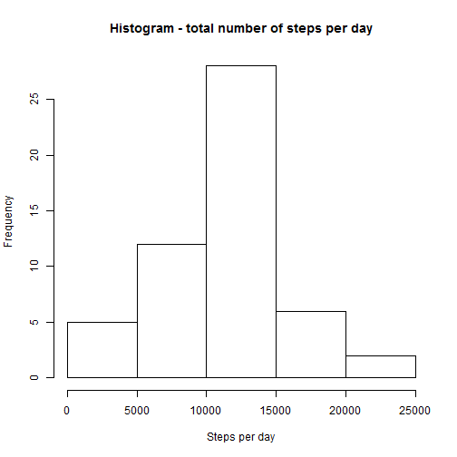
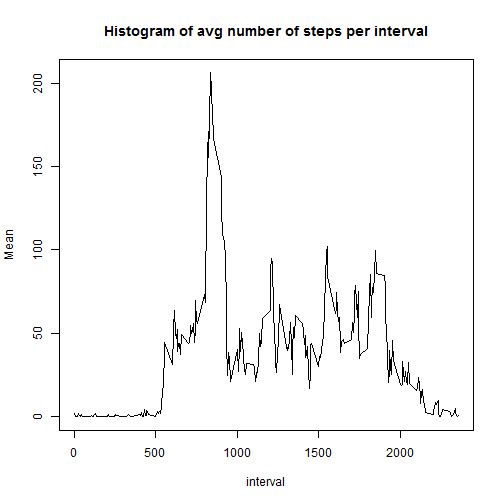
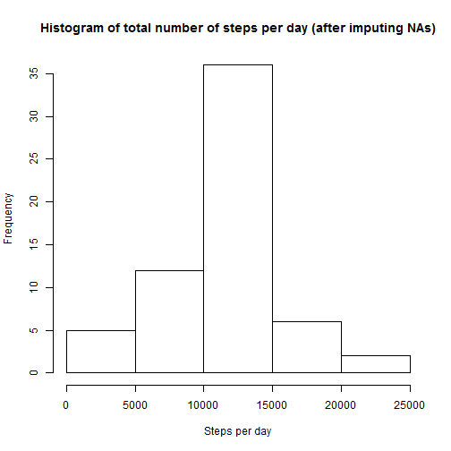
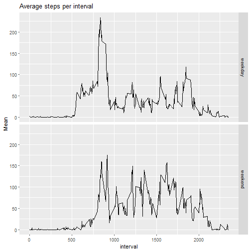

This assignment makes use of data from a personal activity monitoring device. This device collects data at 5 minute intervals through out the day. The data consists of two months of data from an anonymous individual collected during the months of October and November, 2012 and include the number of steps taken in 5 minute intervals each day.

##Loading and preprocessing the data

Show any code that is needed to 
1. Load the data (i.e. read.csv())
2. Process/transform the data (if necessary) into a format suitable for your analysis


```r
#read data
data <- read.csv("./activity.csv")

#chaning format of date to date
data$date <- as.Date(as.character(data$date, format="%Y-%m-%d"))
```

## What is mean total number of steps taken per day?

For this part of the assignment, you can ignore the missing values in the dataset. 
1. Calculate the total number of steps taken per day
2. Make a histogram of the total number of steps taken each day
3. Calculate and report the mean and median of the total number of steps taken per day


```r
#creating new data set with total nr of steps taken per day
library(dplyr)
stepsPERday1 <- group_by(data, date)
stepsPERday <- summarize(stepsPERday1, Sum=sum(steps))

#plotting histogram of total number of steps per day
hist(stepsPERday$Sum, main = "Histogram - total number of steps per day", xlab = "Steps per day")
```



```r
#calculating median and mean    
summary(stepsPERday$Sum)
```

```
##    Min. 1st Qu.  Median    Mean 3rd Qu.    Max.    NA's 
##      41    8841   10760   10770   13290   21190       8
```

In the table above we see the mean and the median of the total number of steps taken per day

## What is the average daily activity pattern?

1. Make a time series plot (i.e. type = "l") of the 5-minute interval (x-axis) and the average number of steps taken, averaged across all days (y-axis)
2. Which 5-minute interval, on average across all the days in the dataset, contains the maximum number of steps?


```r
#group and summarize data per mean interval
avgPERinterval1 <- group_by(data, interval)
avgPERinterval <- summarize(avgPERinterval1, Mean=(mean(steps, na.rm=TRUE)))

#plot lie chart
plot(type="l",
     avgPERinterval,
     main = "Histogram of avg number of steps per interval"
     )
```



```r
#show the interval with maximum number of steps on average
a <- avgPERinterval[which.max(avgPERinterval$Mean),]
max_interval <- a[1,1]
max_steps <- a[1,2]
```

** The interval 835 has the maximum average value of steps 206.1698113.**

## Imputing missing values

Note that there are a number of days/intervals where there are missing values (coded as NA). The presence of missing days may introduce bias into some calculations or summaries of the data.

1. Calculate and report the total number of missing values in the dataset (i.e. the total number of rows with NAs)
2. Devise a strategy for filling in all of the missing values in the dataset. The strategy does not need to be sophisticated. For example, you could use the mean/median for that day, or the mean for that 5-minute interval, etc.
4. Create a new dataset that is equal to the original dataset but with the missing data filled in.
3. Make a histogram of the total number of steps taken each day and Calculate and report the mean and median total number of steps taken per day. Do these values differ from the estimates from the first part of the assignment? What is the impact of imputing missing data on the estimates of the total daily number of steps?


```r
#total number of rows with NA
sum(is.na(data))
```

```
## [1] 2304
```

```r
#replacing NA values with mean per interval
full_data <- merge(data, avgPERinterval, by.x ="interval", by.y="interval", all.x=TRUE)
full_data <- arrange(full_data, date)
full_data$steps[is.na(full_data$steps)] <- full_data$Mean[is.na(full_data$steps)]


full_stepsPERday1 <- group_by(full_data, date)
full_stepsPERday <- summarize(full_stepsPERday1, Sum=sum(steps))

#plotting histogram of total number of steps per day
hist(full_stepsPERday$Sum, main = "Histogram of total number of steps per day (after imputing NAs)", xlab = "Steps per day")
```



```r
#calculating median and mean    
summary(full_stepsPERday$Sum)
```

```
##    Min. 1st Qu.  Median    Mean 3rd Qu.    Max. 
##      41    9819   10770   10770   12810   21190
```

## Are there differences in activity patterns between weekdays and weekends?

1. Create a new factor variable in the dataset with two levels - "weekday" and "weekend" indicating whether a given date is a weekday or weekend day.
2. Make a panel plot containing a time series plot (i.e. type = "l") of the 5-minute interval (x-axis) and the average number of steps taken, averaged across all weekday days or weekend days (y-axis). See the README file in the GitHub repository to see an example of what this plot should look like using simulated data.


```r
weekday_data1 <- mutate(data, day=weekdays(data$date))
weekday_data <- mutate(weekday_data1, day.type = ifelse (day == "zaterdag" | day == "zondag", "weekend", "weekday"))

weekday_avgPERinterval1 <- group_by(weekday_data, interval, day.type)
weekday_avgPERinterval <- summarize(weekday_avgPERinterval1, Mean=(mean(steps, na.rm=TRUE)))

library(ggplot2)
require(ggplot2)
g <- ggplot(weekday_avgPERinterval, aes(x=interval, y=Mean))
g+ geom_line() + labs(title="Average steps per interval") + facet_grid(day.type ~ .)
```


